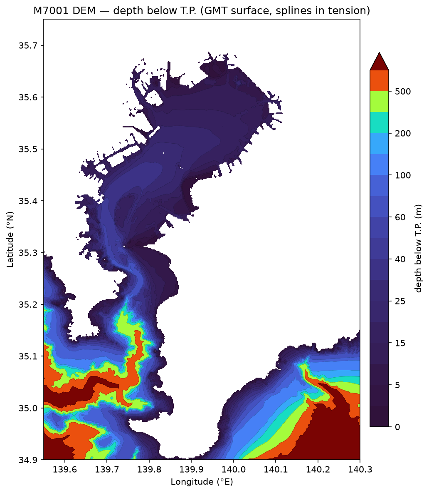

# topobathy

Tools for building **topo-bathymetric** (DEM / bathymetry) datasets.

`topobathy` is an installable, extensible Python package for preparing
topo-bathymetric data — reading source survey/DEM datasets, converting their
vertical/horizontal data, and compositing them into DEMs. The first tool
converts the Japan Coast Guard / JHA **M7001** chart-datum bathymetry to
**Tokyo Peil (T.P.)**; more source readers and DEM-building tools will be added
under the same structure.

## Design

Portability and extensibility (mirroring the `xfvcom` layout):

- **`$DATA_DIR`, never absolute paths.** Data lives under the group-shared
  `$DATA_DIR` (e.g. `.../share/Data`); all paths are resolved through
  `topobathy.config`. Missing env vars **fail loudly**.
- **Sub-packages by concern**, so new datasets/tools slot in without touching
  existing code:

  | sub-package | role |
  |---|---|
  | `topobathy.io` | dataset readers/writers (`read_jbird`, `write_points`, …) |
  | `topobathy.datum` | vertical-datum conversions (`Z0Field`, chart datum ↔ T.P.) |
  | `topobathy.grid` | DEM gridding — `grid_dem` (splines in tension, GMT) |
  | `topobathy.utils` | geospatial helpers (distances, local projection) |
  | `topobathy.config` | `$DATA_DIR`-based path resolution |
  | `topobathy.data` | bundled reference tables (shipped as package data) |
  | `topobathy.cli` | command-line entry points |

- **Canonical point dataset** = a `pandas.DataFrame` (`mark, lon, lat, …`),
  serialisable to CSV / Parquet / NetCDF with a self-describing README sidecar.

## Installation

Use **mamba** (conda-forge). `pip` is allowed **only** for the editable install
of this source tree — never for regular dependencies (mixing pip and conda
binaries breaks the compiled numpy/netCDF stack).

```bash
mamba env create -f environment.yml     # creates the 'topobathy' env + pip install -e .
mamba activate topobathy
# env already created? just: pip install -e . --no-build-isolation --no-deps
```

## Tool: M7001 chart datum → T.P.

M7001 (財団法人日本水路協会「海底地形デジタルデータ」関東南部 Ver.2.4) stores depths
referenced to the **chart datum** (基本水準面 = 略最低低潮面). This tool raises them
to **T.P.** (東京湾平均海面) via the general, Japan-wide **vertical-datum separation
model** — see **[`docs/vertical_datum.md`](docs/vertical_datum.md)** (method,
`SeparationModel`/`GeoidModel`, GSI geoid, nationwide data pipeline). Z0 comes from
the **official JCG 一覧表** (「平均水面、最高水面及び最低水面一覧表」, ~1000 ports
nationwide in `topobathy/data/japan_tide_datums_jcg.csv`); the M7001 conversion uses
a **spatially-varying** offset `Z0(x, y) = T.P. − 基本水準面` interpolated (TIN) from
its 85 Kanto-South ports (`topobathy/data/kanto_south_tp_minus_cd.csv`). Z0 ranges
~1.17 m (inner Tokyo Bay) to ~0.56 m (Izu Islands); a single constant is wrong.
**Use `Z0 = T.P. − 基本水準面 (chart datum)`, NOT `T.P. − 観測基準面 (gauge DL)`**
— the latter is ~0.5–1.0 m larger and gives depths that much too deep. See
**[`docs/m7001.md`](docs/m7001.md)** for the conversion basis, the datum
correction, authoritative source citations (JMA 潮位表 / JCG harmonic constants),
commercial-licensing notice, and the depth contour maps (chart datum, T.P., and
their difference = Z0).

**Output** → `$DATA_DIR/bathymetry/M7001/TP/` as `<name>.{csv,parquet}` plus a
`.README.md` sidecar. Columns:

| column | meaning |
|---|---|
| `mark` | J-BIRD mark: `N` depth · `M` low-tide line · `L` HHW coastline |
| `lon`, `lat` | geodetic degrees (WGS84) |
| `z_tp` | **T.P. elevation (m, positive up; seabed negative).** `N`: `-(depth_cd+z0)`; `M`: `-z0`; `L`: `NaN` (HHW height not in M7001) |
| `depth_cd` | original vertical value = metres below chart datum (0.0 for L/M) |
| `z0` | applied chart-datum → T.P. offset (m) |
| `unit`, `geodetic` | source unit (`MET`) and datum code (`1`=WGS84) |

A T.P. **depth** (positive down) is simply `-z_tp`.

> **Z0 coverage.** The 85-station network spans the whole coastal M7001 extent
> (Tokyo/Sagami/Suruga Bay, Izu Peninsula & Islands). Only the far-offshore SE
> corner of the whole sheet (deep open Pacific to ~7.8 km) lies beyond it, where
> Z0 is IDW-nearest and immaterial. The tool reports the out-of-network fraction
> in the sidecar.

Two products are built (see `scripts/genkai_m7001_to_tp.sh`):

Converted by the rigorous JCG-ERS method (`linear`/TIN of 85 stations — the
official JCG 一覧表 + JMA anchors; leave-one-out CV **RMS 6.3 cm**). Written to
`$DATA_DIR/bathymetry/M7001/TP/`:

| product | domain | contents |
|---|---|---|
| `M7001_TP.{csv,parquet}` | whole Southern Kanto sheet (~3.95 M pts) | point dataset (`z_tp` + `z_ell`) |
| `M7001_chart_datum_model_kanto_south.nc` | whole extent, 1′×1.5′ grid | 最低水面モデル (T.P. + ellipsoidal) |

`M7001_TP` is the single source of truth; a sub-region (e.g. Tokyo Bay) is just its
bounding-box filter, with identical values. `z_ell` (WGS84 ellipsoidal height) =
`z_tp + N` uses the GSI geoid「日本のジオイド2011」([`scripts/get_gsigeo.py`](scripts/get_gsigeo.py),
direct download; `z_tp` itself needs no geoid); defined over Tokyo Bay/coast, NaN
over the open ocean.

### Run

Heavy for the full ~3.95 M-point sheet — run as a **GENKAI batch job**, not on the
login node. The one script writes the point dataset **and** the 最低水面モデル grid:

```bash
pjsub scripts/genkai_m7001_to_tp.sh          # rigorous (TIN) pipeline -> TP/
```

Or invoke the CLIs directly (a bounding box just subsets the same result):

```bash
topobathy-m7001-to-tp --method linear --geoid          # whole sheet -> M7001_TP
topobathy-build-datum-model --bbox 138.2 141.6 33.1 36.0 \
    --out /path/M7001_chart_datum_model.nc     # continuous 最低水面モデル (NetCDF)
```

Library use:

```python
from topobathy import read_jbird, Z0Field, add_tp_elevation, config

df = read_jbird(config.m7001_source_file(), marks=["N"])
df = add_tp_elevation(df, Z0Field.from_csv(config.default_z0_table()))
```

## Tool: bathymetric DEM (splines in tension)

Grid the T.P. soundings into a smooth DEM by the community-standard method — GMT
`surface` (continuous-curvature splines in tension; GEBCO / NOAA), **not** TIN
(which leaves facets and terraces contour data) — then **hydro-flatten** to the
**OSM coastline** (via [`xcoast`](https://github.com/estuarine-utokyo/xcoast); clips
land, incl. reclaimed land/islands). See **[`docs/dem.md`](docs/dem.md)**.

```bash
pjsub scripts/genkai_m7001_dem.sh     # Tokyo Bay DEM -> TP/M7001_dem_tokyobay.nc
```



## Development

```bash
pytest -q          # unit tests (tiny synthetic fixtures; no large data needed)
ruff check . && mypy topobathy && black --check topobathy tests
```

All written artifacts (docs, comments, commit messages) are English; chat
follows the user's language.
