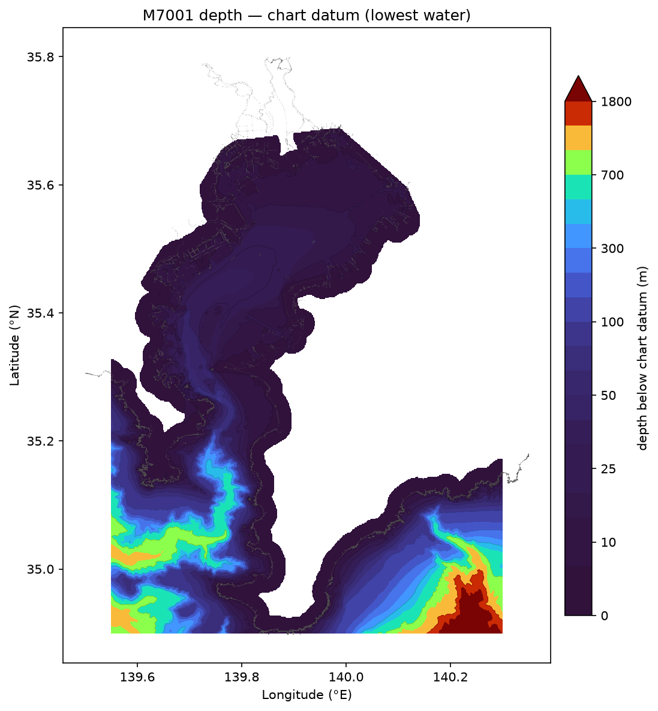
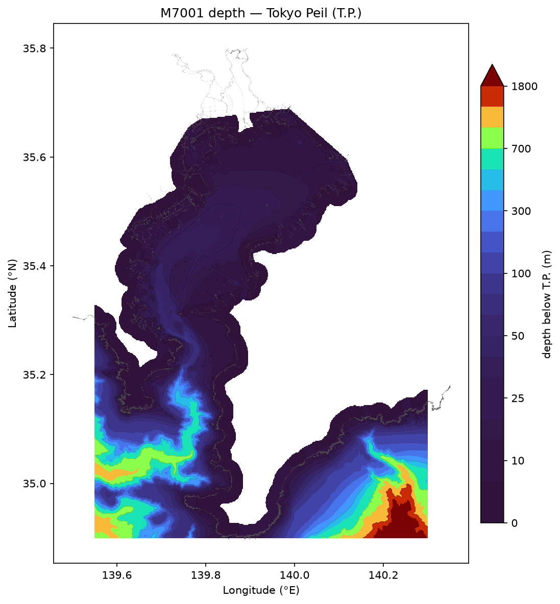
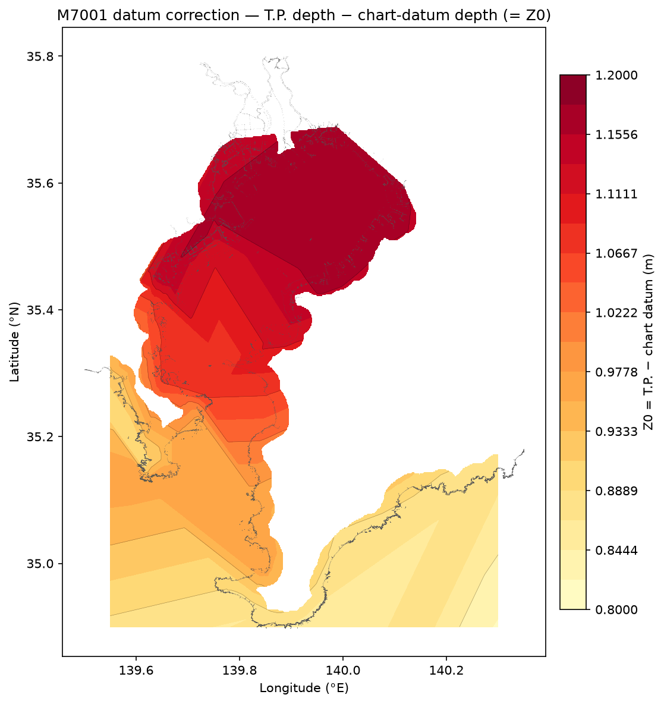

# M7001 bathymetry → Tokyo Peil (T.P.)

Conversion of the JHA / Japan Coast Guard **M7001** survey bathymetry from its
native **chart datum** (基本水準面 ≈ lowest water) to **Tokyo Peil**
(T.P. / 東京湾平均海面, the Japanese national height datum), with a
**spatially-varying** datum offset. Tooling: `topobathy-m7001-to-tp` and
`topobathy-plot-m7001-tp` (see the [repository README](../README.md)).

## What was converted

M7001 stores a depth only on its **N** marks (depth-contour vertices, value =
metres below chart datum). **All N-mark depths were converted** — none dropped:

| quantity | count |
|---|---|
| N (depth) points in the source sheet | **3,753,142** |
| N points written with a T.P. value    | **3,753,142** (100 %) |

Each depth is raised to T.P. by adding the local offset `Z0(x, y)`:

```
depth_TP(x, y) = depth_chart_datum(x, y) + Z0(x, y)
z_tp(x, y)     = − depth_TP(x, y)            # elevation, positive up (seabed negative)
```

Products (in the non-public data directory `$DATA_DIR/bathymetry/M7001/TP/` — see
[Data source & licensing](#data-source--licensing)). Converted by the **rigorous
JCG-ERS method**: `linear`/**TIN** interpolation of the **85-station** network (JCG
official 一覧表 ports + exact JMA 潮位表基準面 anchors; see
[`docs/vertical_datum.md`](vertical_datum.md)); leave-one-out CV uncertainty
**RMS 6.3 cm** (MAE 3.4 cm), within IHO S-44 special order.

| product | domain | contents |
|---|---|---|
| `M7001_TP.{csv,parquet}` | whole "Southern Kanto" sheet, 3,950,314 pts | point dataset (`mark,lon,lat,z_tp,z_ell,depth_cd,z0,…`) |
| `M7001_chart_datum_model_kanto_south.nc` | whole extent, 1′×1.5′ grid | 最低水面モデル (`tp_minus_cd`, `chart_datum_elevation`, `chart_datum_ellipsoidal`) |

`M7001_TP.{csv,parquet}` is the single source of truth for the point data — a
sub-region (e.g. Tokyo Bay) is just its bounding-box filter, with **identical**
values (verified to ~1e-13 m). Likewise the datum-model grid is defined over the
whole extent; a sub-window is a slice of the same 1′×1.5′ grid.

`z_tp` is the **T.P. elevation** (m, +up); `z_ell` = `z_tp + N` is the **WGS84
ellipsoidal height** via the GSI geoid (「日本のジオイド2011」;
[`scripts/get_gsigeo.py`](../scripts/get_gsigeo.py)), defined over Tokyo Bay/coast
(NaN over the open-ocean SE, where GSIGEO is undefined). The chart-datum-model grids
carry the matching `chart_datum_ellipsoidal` (最低水面の楕円体高) for GNSS/ERS use.
See [`docs/vertical_datum.md`](vertical_datum.md) for the ~0.1 m marine-geoid
accuracy note; the T.P. product (6.3 cm) is geoid-independent.

> **Z0 coverage.** The 85-station network (lon 138.2–140.9, lat 33.1–36.9) spans
> Tokyo Bay, Sagami Bay, Suruga Bay, the Izu Peninsula, the Izu Islands and the NE
> Pacific — the whole coastal M7001 extent. Only the far-offshore SE corner (deep
> open Pacific to ~7.8 km) lies beyond the TIN hull, where Z0 falls back to
> IDW-nearest and is immaterial (a ~1 m offset on kilometre depths). The maps below
> are drawn over the Tokyo Bay window.

## Contour maps

Depth of the M7001 N-mark soundings (from `M7001_TP`, restricted to the Tokyo Bay
window), gridded (`scipy.griddata`, linear; `griddata` gaps and cells > 2.5 km from
any sounding are blanked). Grey dots are the M7001 coastline (`L`, HHW) and low-tide
(`M`) waterline marks, drawn for geographic context.

### 1. Original depth — chart datum (基本水準面)



Depth below the native chart datum. Tokyo Bay proper is shallow (mostly < 30 m);
depth increases through the Uraga mouth, and the SW / SE corners are the deep
Sagami Bay and off-Bōsō Pacific (bathymetric, non-uniform contour intervals).

### 2. Converted depth — Tokyo Peil (T.P.)



Depth below T.P. Visually near-identical to map 1 — Z0 is only a ~1 m shift on
depths of up to hundreds of metres — which is exactly why the correction is shown
separately below.

### 3. Difference (T.P. − chart datum) = the applied Z0



The conversion adds Z0 everywhere, so the difference map **is** the
spatially-varying Z0 field. Z0 grows from ~0.9 m near the bay mouth toward
**~1.15–1.17 m** in the inner bay (東京 Tokyo, 千葉 Chiba), tracking the tidal
range. The concentric "bull's-eyes" are the tide-station anchor points of the
inverse-distance interpolation. **A single constant Z0 would be wrong here** — it
mis-corrects between the inner bay and the mouth by ~0.3 m; and the once-used
"T.P. − gauge DL" values (~1.9 m) are wrong by ~0.6–1.0 m (see below).

## Vertical datum conversion basis (Z0)

`Z0 = T.P. − 基本水準面` is the height of T.P. above the **chart datum** (基本水準面
= 略最低低潮面, approximately lowest low water), i.e. the metres ADDED to a chart-datum
depth to get a T.P.-referenced depth. By the official definition the chart datum sits
below local mean sea level by `Z0 ≈ Hm2 + Hs2 + Hk1 + Ho1` (the sum of the four
principal tidal constituent amplitudes), which grows with the tidal range toward the
inner bay. This is the Japan-wide **vertical-datum separation model** — the general
method, nationwide data pipeline and ellipsoidal / GSI-geoid branch are documented
in **[`docs/vertical_datum.md`](vertical_datum.md)**. For M7001, Z0 is interpolated
(power-2 IDW, great-circle; also `--method linear|tps`) from **45 JMA/JCG tide
stations** spanning Tokyo Bay, Sagami Bay, Suruga Bay, the Izu Peninsula and the Izu
Islands:

| region | example stations | Z0 = T.P. − 基本水準面 (m) |
|---|---|---:|
| inner Tokyo Bay | 東京 1.14, 千葉 1.17, 船橋 1.17 | ~1.15–1.17 |
| bay mouth | 浦賀 0.97, 久里浜 0.97, 横須賀 1.07 | ~1.0 |
| Sagami Bay | 横浜 1.15, 江ノ島 0.89, 真鶴 0.94 | ~0.9–1.15 |
| Suruga Bay | 清水 0.864, 御前崎 0.965, 石廊崎 0.957 | ~0.9 |
| Boso Pacific / Izu Is. | 布良 0.867, 大島 0.848, 三宅島 0.638, 八丈島 0.563 | ~0.56–0.9 |

Table: [`topobathy/data/kanto_south_tp_minus_cd.csv`](../topobathy/data/kanto_south_tp_minus_cd.csv)
(45 stations, shipped as package data), built by
[`scripts/build_z0_table.py`](../scripts/build_z0_table.py). Override with
`topobathy-m7001-to-tp --z0-table <csv>`.

### ⚠ Correction: chart datum (基本水準面), not gauge datum (観測基準面/DL)

An earlier version of this conversion used a "JODC TideAttrib **T.P. above local DL**"
table (東京 1.884, 横浜 2.179 m, …). **That was wrong for M7001.** "DL" there is the
gauge **observation datum (観測基準面)**, which JMA sets *below* the chart datum so
readings stay positive — it is **not** the 基本水準面 that M7001 depths reference. The
old values over-stated Z0 by **~0.5–1.0 m** (so the first T.P. products were that much
too deep in the inner bay). Verified against the authoritative T.P. − chart-datum:

| station | JMA 潮位表基準面 (T.P. − 基本水準面) | harmonic z0 (Hm2+Hs2+Hk1+Ho1) | old "T.P. − DL" (wrong) |
|---|---:|---:|---:|
| 東京 Tokyo | **1.141 m** | 1.169 | 1.884 |
| 横浜 Yokohama | **1.150 m** | 1.147 | 2.179 |
| 布良 Mera | **0.867 m** | 0.935 | 1.384 |

The JMA tide-table datum and the harmonic-constant z0 agree to a few cm (the small
`MSL − T.P.` offset), and both are ~0.5–1.0 m below the old gauge-datum values.

**Sources of the Z0 numbers**

- **JMA/JCG 60-constituent harmonic constants** (`海保/気象庁公開値`) for 38 Tokyo
  Bay / Sagami / Boso stations, via `$DATA_DIR/tides/ptide/Tide-ToKYOWAN.txt`; the
  published `z0` field (平均水面上の高さ) equals `Hm2+Hs2+Hk1+Ho1` (verified) = MSL
  above chart datum. JCG harmonic constants:
  <https://www1.kaiho.mlit.go.jp/TIDE/harmonic/> .
- **JMA tide-table datum** (潮位表基準面の標高 = −(T.P. − 基本水準面)) for the Suruga
  Bay / Izu-Islands gap, from the JMA tidal database (per-station):
  <https://www.data.jma.go.jp/kaiyou/db/tide/suisan/> .
- Harmonic z0 (MSL − chart datum) is converted to T.P. − chart datum by subtracting
  the local `MSL − T.P.` ≈ 0.03 m (anchored on the JMA values above).

**Datum definitions** (气象庁 用語集; 海上保安庁)

- **T.P. (Tokyo Peil, 東京湾平均海面)** — the Japanese national height datum (標高 0 m),
  the 1873–1879 mean sea level at 霊岸島, realised through 日本水準原点; maintained by
  GSI (国土地理院). <https://www.gsi.go.jp/>
- **基本水準面 (chart datum)** — "海図に記載されている水深の基準面。港湾ごとに定められている"
  (JMA 用語集); ≈ 略最低低潮面 = 平均水面 − `Z0`. The datum M7001 depths use.
- **観測基準面 (DL, observation datum)** — "各検潮所毎に設定された潮位を観測する基準面。
  通常、観測値が負にならないように設定する" (JMA 用語集); set *below* the chart datum,
  hence **not** interchangeable with 基本水準面. (This is the datum the superseded
  "T.P. − DL" table measured against.)

## Data source & licensing

**Source dataset — commercial / proprietary.** M7001 is
「海底地形デジタルデータ M7001（関東南部）Ver.2.4」(2022-10), a **commercial
product published for sale by the 一般財団法人 日本水路協会 (Japan Hydrographic
Association, JHA)**, derived from **海上保安庁 (Japan Coast Guard)** nautical
charts. It is **not open data** and is **not redistributed** in this repository.

- The purchased M7001 product (fixed-column ASCII, ESRI shapefiles, bundled
  viewer) and the **derived T.P. point datasets** (`M7001_TP*.{csv,parquet}`)
  reside only in the **non-public** data directory
  `$DATA_DIR/bathymetry/M7001/` (group-shared, not part of this repo). See
  `$DATA_DIR/bathymetry/M7001/README.md` for the full product description.
- This **public repository** contains only the **conversion code** and the
  **low-resolution derived contour figures** above — not the underlying
  M7001 point data. Redistribution of the M7001 data itself is governed by the
  JHA licence terms.

## References

Datum definitions and Z0 values were confirmed against these primary sources:

1. **M7001 product manual** — `ascii/help/データの概要/format.htm` (bundled with the
   dataset): "N …等深線の線上点．**基本水準面**からの水深値"; "M …**基本水準面（略最低
   低潮面）**". Confirms M7001 depths are on the chart datum = 略最低低潮面.
2. **気象庁 (JMA) 潮汐用語集** — 基本水準面 = "海図に記載されている水深の基準面。港湾ごと
   に定められている"; 観測基準面(DL) = "各検潮所毎に設定…通常、観測値が負にならないように
   設定する". <https://www.data.jma.go.jp/kaiyou/db/tide/knowledge/tide/yougo.html>
3. **気象庁 潮位表** — 潮位表基準面の標高 (= −(T.P. − 基本水準面)): 東京 −114.1 cm,
   横浜 −115.0 cm, 布良 −86.7 cm, 御前崎 −96.5 cm, 石廊崎 −95.7 cm, 大島岡田 −84.8 cm,
   三宅島 −63.8 cm, 八丈島 −56.3 cm (2026).
   <https://www.data.jma.go.jp/kaiyou/db/tide/suisan/>
4. **海上保安庁 海洋情報部** — 潮汐調和定数 / 基本水準面 (略最低低潮面 = 平均水面 −
   (Hm2+Hs2+Hk1+Ho1)); 「平均水面、最高水面及び最低水面の高さ」.
   <https://www1.kaiho.mlit.go.jp/TIDE/harmonic/> · <https://www1.kaiho.mlit.go.jp/TIDE/datum/>
5. **JHA (日本水路協会)** M7001 product. <https://www.jha.or.jp/>
